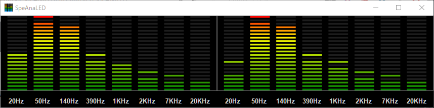
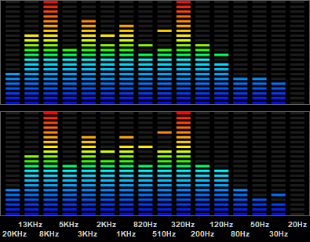
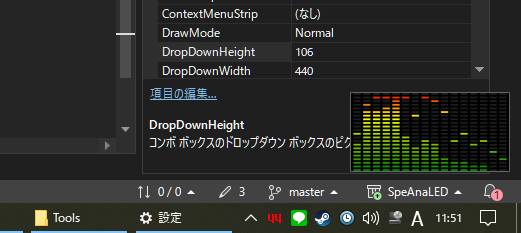

# SpeAnaLED
## About
- **SpeAnaLED** is a WASAPI([Windows Audio Session API](https://en.wikipedia.org/wiki/Technical_features_new_to_Windows_Vista#Audio_stack_architecture)) Loopback Spectrum-Analyzer-like visualizer with LED-matrix-like visualization. (L+R Max. 2 channels)
- "Loopback" means,
    - You don't need to load files,
    - You don't need mic,
    - You don't need line cables,
    - Simply use a PC sound card or device to play music on your favorite player, for example, foobar2000, Youtube or Amazon Music in various browsers, AppleMusic (iTunes), Spotify desktop app, etc., **SpeAnaLED** should intercept sounds and work.
- **SpeAnaLED** can be re-sized, so you can reside on your PC desktop by putting it on your "Startup" folder.
- **SpeAnaLED** is a tiny program. Its size of executable file is about 64KB itsdelf, about 900KB including dlls. In the case of my 8 years old PC, CPU load is 0.1% or less, uses about 90MB process memory. No use of DirextX 2D, only GDI/GDI+ Win32API(System.Drawing(.Drawing2D)) is used.

## Requirements
- Windows PC with WASAPI (Vista or later)
- [.NET4.8 runtime](https://dotnet.microsoft.com/en-us/download/dotnet-framework/thank-you/net48-web-installer) (Probably already you've installed)
- [Un4seen](http://www.un4seen.com)'s
    - [bass.dll](http://www.un4seen.com/download.php?bass24) (Ver.2.4)
    - [basswasapi.dll](http://www.un4seen.com/download.php?basswasapi24) (Ver.2.4)
    - [Bass.NET.dll](https://www.nuget.org/api/v2/package/Bass.NetWrapper/2.4.12.5) (Ver.2.4.12.5 from [nuget.org](https://nuget.org). 2.4.17~ doesn't work)
- virtualdreams's
    - [ConfigFile.dll](https://www.nuget.org/packages/ConfigFile/1.0.9)
- Sound card or device supports WASAPI
- Software to play music supports WASAPI
  

## Screenshot
- LED colors Horizontal 16 bars layout(default) 

- Classic colors 8 bars layout 

- Simple color without frequency label and titlebar 

- Vertical layout without titlebar 

- Rainbow colors left flip(center-Low) without peakhold, label and titlebar 

- Simple color 8 bars  right flip(center-Hi) 

- You can change form vertical and horizontal size severally. (free aspect-ratio) 

- So, it can be placed on the desktop in a very small size 

  

## Other features
- Sound device select (If you have 2 or more.)
    - Windows sound control panel also must be changed by yourself.
- Peakhold-time adjust
- Peakhold descent speed adjust
- Sensitivity adjust
- "Always on Top" enabling
- Preventing screensaver
- Mono (L+R mix 1ch.) mode
- Save settings
- 4 bars (Who would use it?)
  

Changes to most display settings take effect in real time.

These settings, including color-type and number of bars, can be used at same time.

  

## Acknowledgements
- Of course, to the authors of these wonderful libraries.
- To [h0uri](https://www.instructables.com/Audio-Spectrum-Software-C/), most part of Analyzer.cs ideas.
- To [hvianna](https://github.com/hvianna), drawing ideas and color settings from [audioMotion-analyzer
](https://github.com/hvianna/audioMotion-analyzer)(javascript).
- To whom it may concern ;-)
  

## Other precautions

<strong>SpeAnaLED</strong> is simply made to be seen and enjoyed by myself. The values including frequency displayed is most likely not accurate.

If a problem occurs, first try deleting your configuration file(SpeAnaLED.conf) and restarting <strong>SpeAnaLED</strong>. (After that, enumerate sound device from setting dialog again.)

Have fun music!

## License
**SpeAnaLED** itsself, is a [MIT License](./LICENSE.md) software.

Use of each DLL(library) must be in accordance with the respective license.
  
## Win32 Executable binaries
See "Releases" on the right side.