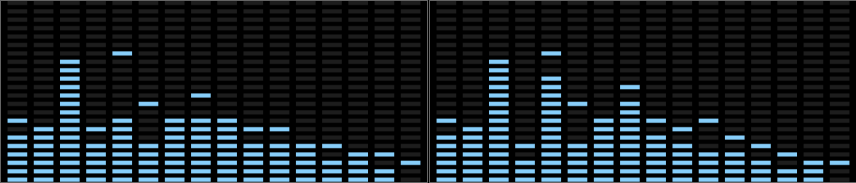
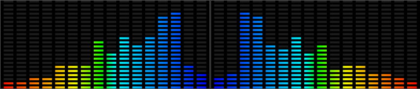
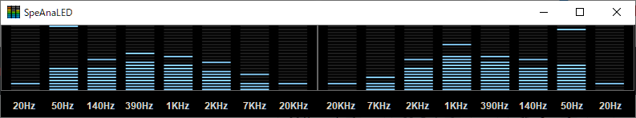
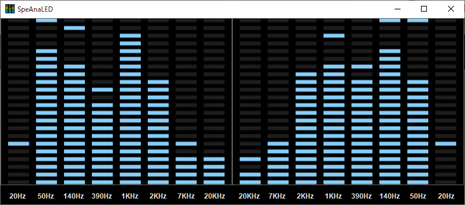

# SpeAnaLED
---
## About
***
- **SpeAnaLED** is a WASAPI([Windows Audio Session API](https://en.wikipedia.org/wiki/Technical_features_new_to_Windows_Vista#Audio_stack_architecture)) Loopback Spectrum Analyzer with LED like visualization. (L+R Max. 2 channels)
- "Loopback" means,
    - You don't need to load files,
    - You don't need mic,
    - You don't need line cables,
    - Just play your sound on your favorite player like, foobar2000, Youtube on any sorts of browser, AppleMusic(iTunes) , Spotify, etc. on your PC with your sound card or device, SpeAnaLED will perhaps works.
  
## Requirements
***
- Windows PC with WASAPI (Windows Vista or later)
- .Net4.8 runtime (Probably already you installed)
- Sound card or device supports WASAPI
- Un4seen's
    - [bass.dll](http://www.un4seen.com/download.php?bass24) (Ver.2.4)
    - [basswasapi.dll](http://www.un4seen.com/download.php?basswasapi24) (Ver.2.4)
    - [Bass.NET.dll](http://www.un4seen.com) (Ver.2.4.12.5)
- virtualdreams's
    - [ConfigFile.dll](https://www.nuget.org/packages/ConfigFile/1.0.9)
  
## Screenshot
***

- Default LED colors Horizontal 16 bars layout

- Classic colors 8 bars layout

- Simple color without frequency label & titlebar

- Rainbow colors left flip(center-Low) without peakhold, titlebar and label

- Simple color 8 bars  right flip(center-Hi)

- You can change form vertical and horizontal size.
  
## Other features
***
- Sound device select (If you have 2 or more.)
- Peakhold-time adjust
- Sensitivity adjust
- "Always on Top" enabling
- Preventing screensaver
- Mono (L+R mix 1ch.) mode
- Save settings
- 4 bars (Who would use it?)
  
## Acknowledgements
***
- Of course, to the authors of these wonderful libraries.
- To [h0uri](https://www.instructables.com/Audio-Spectrum-Software-C/), most part of Analyzer.cs ideas.
- To [hvianna](https://github.com/hvianna), drawing idea and color settings from [audioMotion-analyzer
](https://github.com/hvianna/audioMotion-analyzer)(javascript).
- To whom it may concern ;-).
  
## Other precautions
***
**SpeAnaLED** is simply made to be seen and enjoyed. The frequency displayed is most likely not accurate.
  
## License
***
[MIT License](./LICENSE.md)
